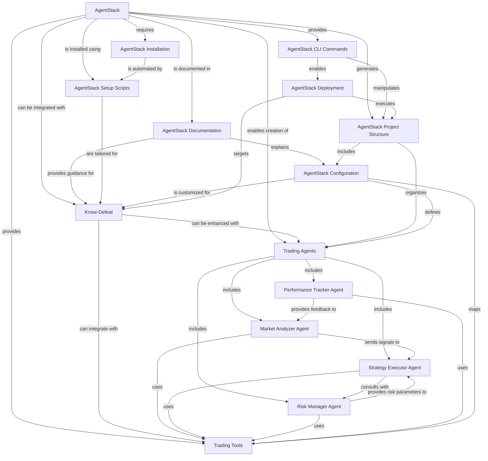

# 🕸️ AgentStack Knowledge Graph Summary

> *A structured representation of AgentStack knowledge for the Know-Defeat trading system*

---

## 📊 Knowledge Graph Visualization

 // Start of Selection
 

## 📁 Entity Types

| Entity Name | Type | Description |
|-------------|------|-------------|
| AgentStack | Tool | Developer tool for scaffolding agent projects |
| Know-Defeat | Project | Algorithmic trading system that can be enhanced with AgentStack |
| Trading Agents | Concept | AI-powered agents specialized for trading functions |
| Market Analyzer Agent | AgentType | Agent specialized for analyzing market data |
| Strategy Executor Agent | AgentType | Agent specialized for executing trading strategies |
| Risk Manager Agent | AgentType | Agent specialized for risk management |
| Performance Tracker Agent | AgentType | Agent specialized for performance tracking |
| Trading Tools | ToolCategory | Collection of tools for trading operations |
| AgentStack Documentation | Resource | Documentation for AgentStack in docs/agentstack/ |
| AgentStack Setup Scripts | Resource | Scripts to automate AgentStack installation |
| AgentStack Configuration | Resource | YAML/JSON files to configure AgentStack projects |
| AgentStack Installation | Process | Process of installing AgentStack |
| AgentStack Project Structure | Organization | Directory structure for AgentStack projects |
| AgentStack Deployment | Process | Process of running AgentStack projects |
| AgentStack CLI Commands | Tool | Command-line interface commands for AgentStack |

## 🔍 Key Concepts & Relationships

### AgentStack
- **Is a**: Developer tool for scaffolding agent projects
- **Can be integrated with**: Know-Defeat trading system
- **Enables creation of**: Trading agents for various functions
- **Is documented in**: docs/agentstack/ directory
- **Is installed using**: Setup scripts tailored for Know-Defeat
- **Provides**: CLI commands, trading tools, project structure

### Know-Defeat Integration
- **Is enhanced by**: Trading agents for market analysis, execution, etc.
- **Has documentation in**: docs/agentstack/ directory
- **Uses**: Autogen conda environment
- **Requires**: Database connectivity to tick_data PostgreSQL

### Trading Agent Workflow
1. **Market Analyzer Agent** → Analyzes market data
2. **↓** Sends signals to
3. **Strategy Executor Agent** → Executes trading strategies
4. **↓** Consults with
5. **Risk Manager Agent** → Manages risk parameters
6. **↓** Provides feedback to
7. **Performance Tracker Agent** → Tracks performance
8. **↓** Provides insights to Market Analyzer

### Configuration & Deployment
- **AgentStack Configuration**: Defines agents, tasks, tools, and settings
- **Project Structure**: Organizes agents, tasks, and tools in directories
- **CLI Commands**: Manipulate project structure and enable deployment
- **Deployment Process**: Targets Know-Defeat and executes project structure

## 📈 Trading Agent Types

| Agent Type | Role | Tools Used | Workflow Position |
|------------|------|------------|-------------------|
| Market Analyzer | Identify trading opportunities | Technical indicators, pattern recognition | First in workflow |
| Strategy Executor | Execute trading strategies | Order execution, position management | Second in workflow |
| Risk Manager | Monitor positions and manage risk | Risk calculation, position sizing | Third in workflow |
| Performance Tracker | Track and analyze performance | Metrics calculation, equity curves | Fourth in workflow |

## 🛠️ Trading Tools Categories

- **Technical Indicators**: SMA, EMA, RSI, etc.
- **Order Execution**: Market orders, limit orders
- **Risk Management**: Volatility estimation, position sizing
- **Performance Tracking**: Metrics calculation, equity curves
- **Database Integration**: PostgreSQL connection

## 📚 Documentation Resources

| Resource | Path | Description |
|----------|------|-------------|
| Core Documentation | docs/agentstack/README.md | Main AgentStack reference |
| Trading Integration | docs/agentstack/trading_integration.md | Guide for integrating with Know-Defeat |
| Sample Configuration | docs/agentstack/sample_config.yaml | Example configuration file |
| Setup Scripts | docs/agentstack/setup_agentstack.bat/sh | Windows and Linux/macOS setup scripts |
| Knowledge Summary | docs/AgentStack_Knowledge_Summary.md | Comprehensive guide in Notion style |

## 🚀 Getting Started

1. **Installation**: Use setup scripts to install in Autogen environment
2. **Project Initialization**: Run `agentstack init` with wizard
3. **Agent Creation**: Generate specialized trading agents
4. **Tool Configuration**: Add trading tools to agents
5. **Task Definition**: Create tasks for market analysis, execution, etc.
6. **Deployment**: Run with `agentstack run`

---

> *This knowledge graph summary is part of the Know-Defeat trading system documentation.* 