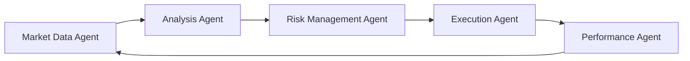

# 🧠 AgentStack Knowledge Base

> *A comprehensive guide to using AgentStack for the Know-Defeat trading system*

---

## 📑 Table of Contents

- [What is AgentStack?](#what-is-agentstack)
- [Getting Started](#getting-started)
- [Trading System Integration](#trading-system-integration)
- [Agent Configuration](#agent-configuration)
- [Custom Trading Tools](#custom-trading-tools)
- [Best Practices](#best-practices)
- [Resources](#resources)

---

## 🤔 What is AgentStack?

AgentStack is a powerful development tool for quickly scaffolding AI agent projects. Similar to how `create-next-app` works for web applications, AgentStack provides a streamlined way to set up agent-based systems.

### Key Features

- ⚡ **Quick Project Setup** - Initialize projects with `agentstack init`
- 🛠️ **CLI Tooling** - Generate agents and tasks through simple commands
- 🧰 **Pre-built Tools** - Access numerous ready-to-use agent tools
- 🔄 **Framework Agnostic** - Works with multiple agent frameworks

> 💡 **Core Insight:** AgentStack dramatically reduces the setup time for agent-based systems, allowing developers to focus on implementing business logic rather than boilerplate code.

---

## 🚀 Getting Started

### Installation Options

AgentStack can be installed through several methods:

| Method | Command |
|--------|---------|
| Installer Script | `curl --proto '=https' --tlsv1.2 -LsSf https://install.agentstack.sh \| sh` |
| Brew | `brew tap agentops-ai/tap && brew install agentstack` |
| pipx | `pipx install agentstack` |
| UV | `curl -LsSf https://astral.sh/uv/install.sh \| sh && uv venv && uv pip install agentstack` |

For Know-Defeat, we recommend installing within the Autogen conda environment:

```bash
conda activate Autogen
pip install agentstack
```

### Initialization

Create a new project with:

```bash
agentstack init <project_name>
```

For a guided setup experience:

```bash
agentstack init <project_name> --wizard
```

> 📋 **For Know-Defeat:** We've created setup scripts at `docs/agentstack/setup_agentstack.bat` (Windows) and `docs/agentstack/setup_agentstack.sh` (Linux/macOS).

---

## 🔄 Trading System Integration

AgentStack provides significant advantages for algorithmic trading systems like Know-Defeat:

### Integration Benefits

1. 📊 **Specialized Agents** - Create dedicated agents for analysis, execution, and risk management
2. 🔌 **Custom Tool Integration** - Easily connect to databases, APIs, and trading infrastructure
3. 📝 **Task Orchestration** - Manage complex trading workflows through structured tasks
4. 📈 **Performance Tracking** - Monitor and evaluate agent performance metrics

### Agent Workflow Example



---

## ⚙️ Agent Configuration

The `sample_config.yaml` file provides a complete configuration for trading agents:

### Key Configuration Sections

- **Project Settings** - Name, description, and framework selection
- **Inputs** - Trading parameters that can be overridden at runtime
- **Agents** - Configuration for each specialized trading agent
- **Tasks** - Definition of agent tasks and their inputs/outputs
- **Database** - Connection information for the Know-Defeat database
- **Tools** - Mapping of tool names to their implementations

### Example Agent Structure

```yaml
market_analyzer:
  name: "Market Analyzer"
  role: "Trading Market Analyzer"
  goal: "Analyze market data and identify potential trading opportunities"
  backstory: "An expert trading analyst with years of experience in pattern recognition"
  llm: openai/gpt-4-turbo
  tools:
    - technical_indicators
    - market_data_fetch
    - chart_pattern_recognition
    - sentiment_analysis
```

---

## 🔧 Custom Trading Tools

AgentStack allows creating specialized tools for trading operations:

### Key Tool Categories

| Category | Purpose | Example Tools |
|----------|---------|---------------|
| Analysis | Process market data | Technical indicators, pattern recognition |
| Execution | Place and manage orders | Market orders, limit orders |
| Risk | Manage position sizing | Volatility estimation, position sizing |
| Performance | Track trading results | Equity curves, metrics calculation |

### Example Technical Indicator Tool

```python
# tools/technical_indicators.py
import pandas as pd
import ta

def calculate_indicators(data, indicators=None):
    """Calculate technical indicators for market data"""
    if indicators is None:
        indicators = ['sma', 'ema', 'rsi']
    
    result = {}
    
    for indicator in indicators:
        if indicator == 'sma':
            result['sma_20'] = ta.trend.sma_indicator(data['close'], window=20)
            result['sma_50'] = ta.trend.sma_indicator(data['close'], window=50)
        # ... other indicators
            
    return result
```

---

## 🏆 Best Practices

When using AgentStack with Know-Defeat, follow these guidelines:

### Development Best Practices

- **Modular Tools** - Create focused tools that do one thing well
- **Clear Data Flows** - Define explicit data formats between agents
- **Prompt Engineering** - Craft role descriptions specific to trading functions
- **Testing** - Create test cases with historical market data
- **Logging** - Implement comprehensive logging for debugging

### Deployment Considerations

1. **Environment Management** - Use the Autogen conda environment
2. **Database Connectivity** - Ensure proper configuration to the tick_data database
3. **API Credentials** - Securely store trading API credentials
4. **Monitoring** - Implement monitoring for agent performance
5. **Logging** - Set up comprehensive logging for debugging

---

## 📚 Resources

### Documentation

- [AgentStack Core Documentation](docs/agentstack/README.md)
- [Trading Integration Guide](docs/agentstack/trading_integration.md)
- [Sample Configuration](docs/agentstack/sample_config.yaml)

### Setup Scripts

- Windows: [setup_agentstack.bat](docs/agentstack/setup_agentstack.bat)
- Linux/macOS: [setup_agentstack.sh](docs/agentstack/setup_agentstack.sh)

### External Resources

- [AgentStack Official Documentation](https://docs.agentstack.sh/)
- [AgentStack GitHub Repository](https://github.com/agentops-ai/agentstack)

---

> *This knowledge base is part of the Know-Defeat trading system documentation.* 